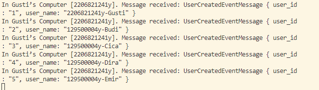
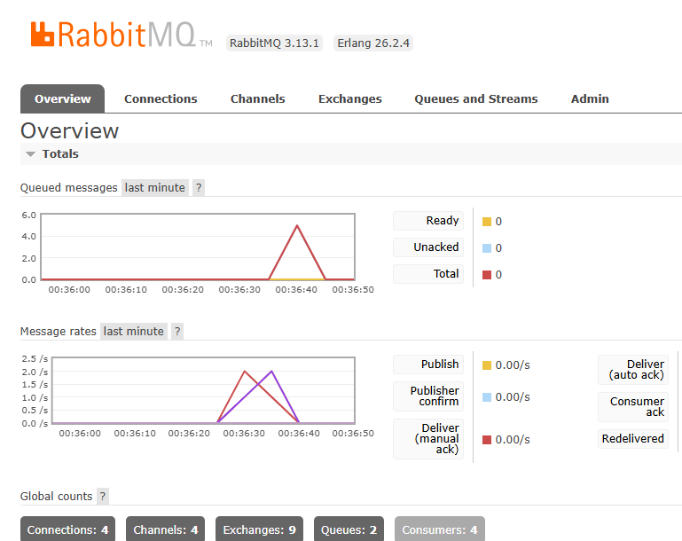

# Reflection 1

a. what is amqp?

- AMQP stands for Advanced Message Queuing Protocol. It's like a super organized way for different computer programs to communicate with each other. Instead of apps directly talking to each other, they send messages through a middleman called a message broker. This broker makes sure the messages get to the right place at the right time. It's important because it helps keep things organized, efficient, and reliable in computer systems.

b. what it means? guest:guest@localhost:5672 , what is the first quest, and what is the second guest, and what is localhost:5672 is for? 

- In "guest:guest@localhost:5672", the first "guest" is the username, and the second "guest" is the password. "localhost:5672" refers to the address and port number of the server. "localhost" typically means the server is running on the same machine where the client is running, and "5672" is the default port number for AMQP communication. So, this string represents the credentials (username and password) for accessing an AMQP server running on the local machine.

## Sending and Processing event.

Here, what is happening is, the subscriber is receiving 5 messages that are computers. We know these are 5 different objects since they have 5 unique IDs and they have different NPMs or different codes. 

## Reflection and Running at least three subscribers

Here, I ran three subscribers. We see that the peak is smaller since the queue now does include many processes that need to be run. Why is that? well, since many subscribers are running, the processes are processed concurrently. 

For things to improve, I noticed that error handling seems to be minimal. In real-world applications, it's important to handle errors gracefully. For example, when creating a new listener or publisher, it's good practice to handle potential errors instead of unwrapping them.